## 🚀 README - Mise en place de la stack ELK (Elasticsearch, Logstash, Kibana)

### 📌 Prérequis
#### Avant de commencer, assurez-vous d'avoir installé :

- 🐳 Docker
- 📦 Docker Compose
- 🐫 Elastisearch, Kibana et Logstash
### 🚀 Lancer les services:
Créez un fichier docker-compose.yml avec le contenu suivant :
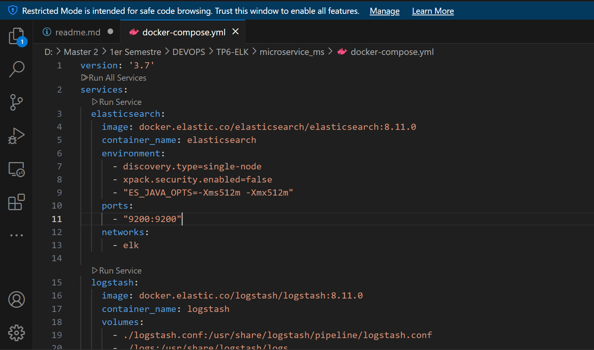
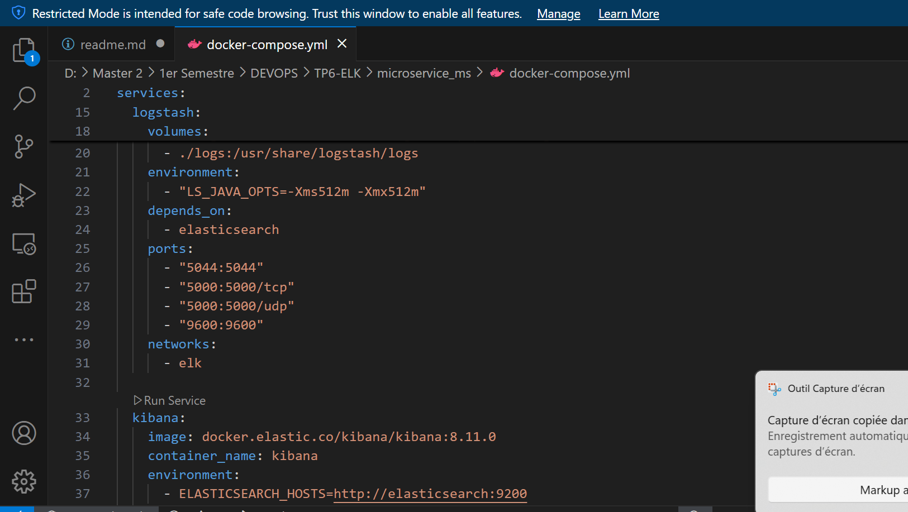
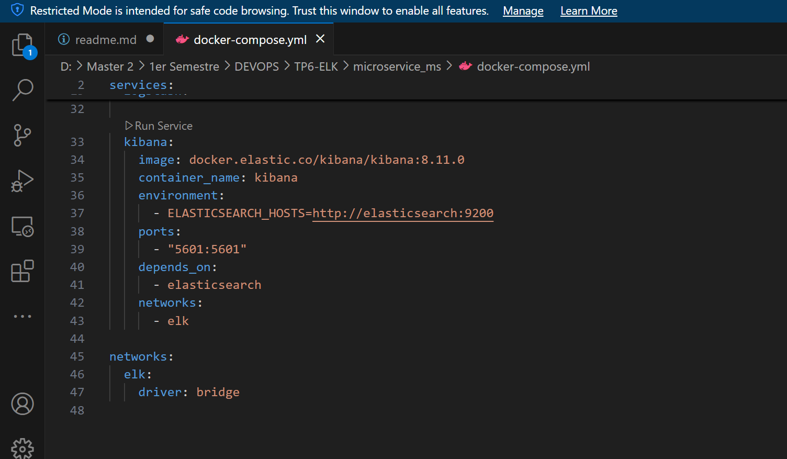
### Démarrez les services avec la commande suivante :
````sh
docker compose up
````
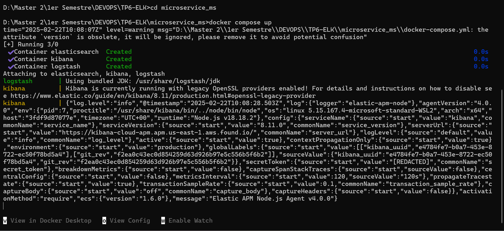
### 📌 Les conteneurs sont maintenant en cours d'exécution :
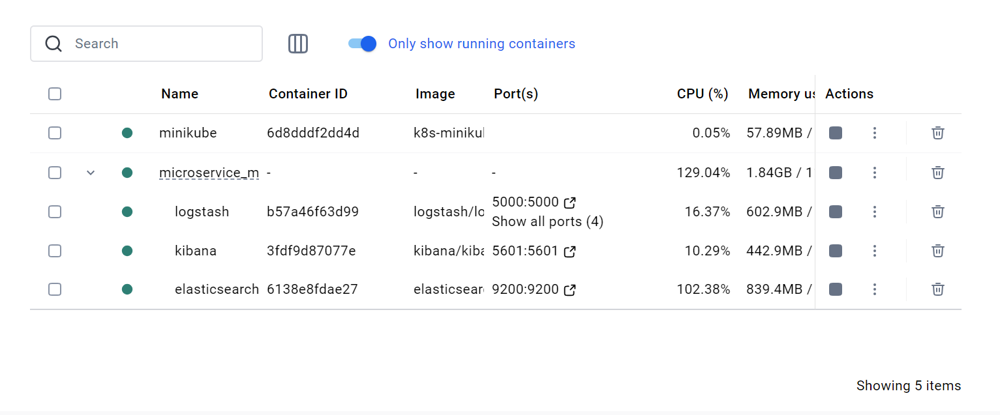
### 🔍 Accéder à Kibana et configurer les logs:
#### 1️⃣ Ouvrez Kibana dans votre navigateur et suivez les étapes ci-dessous :
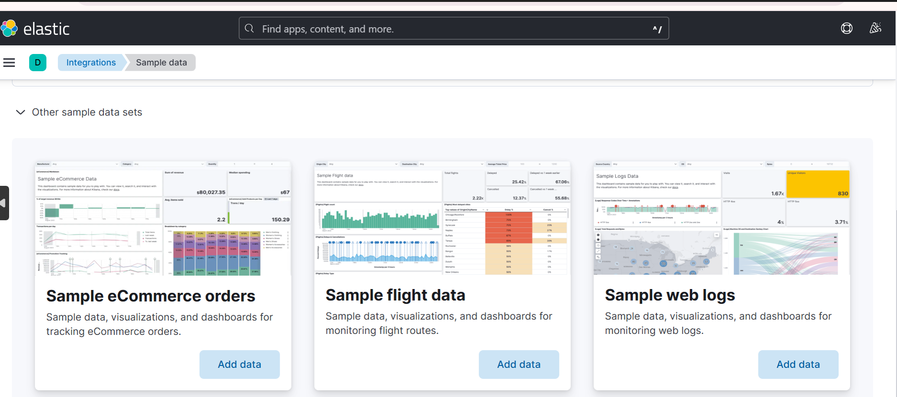
#### 2️⃣ Cliquez sur "Sample Web Logs"
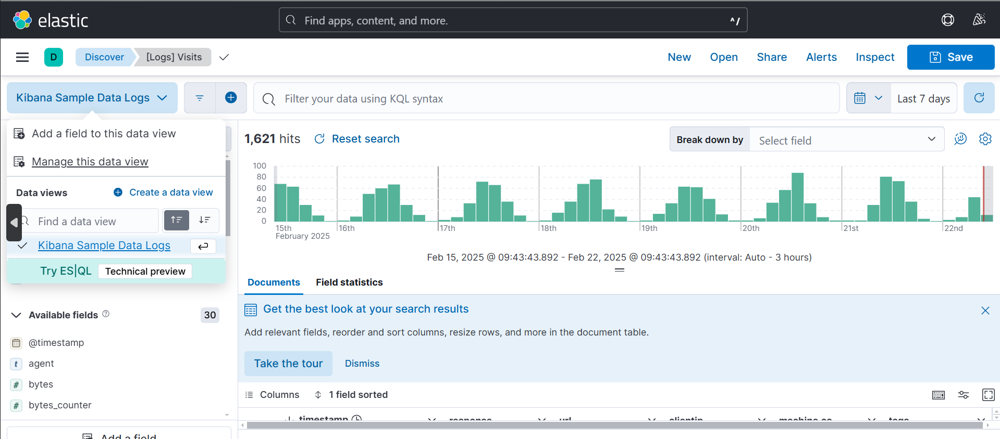
#### 3️⃣ Allez dans Management > Settings et éditez le Data View
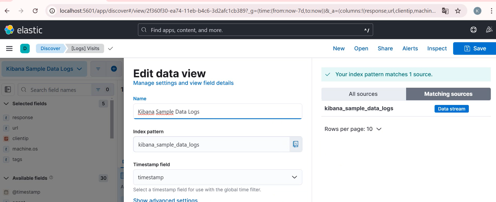
#### 4️⃣ Vous verrez maintenant les logs de Kibana et ceux de votre application
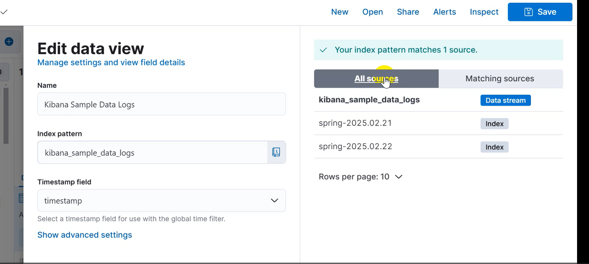
### 📊 Vérifier l'Index Management:
#### Accédez à la section Index Management pour valider vos données :
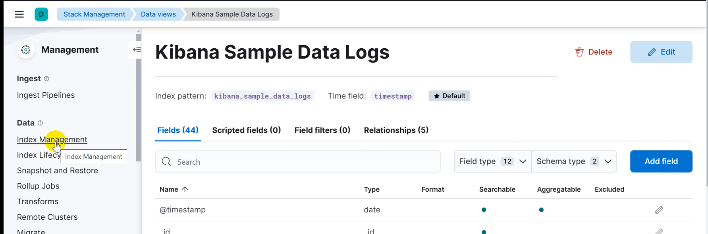
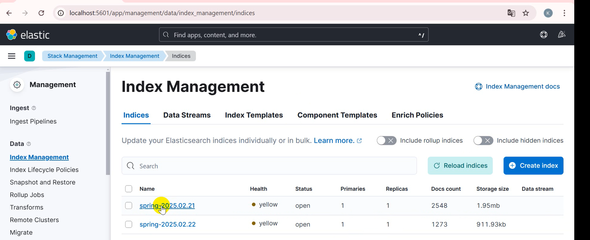
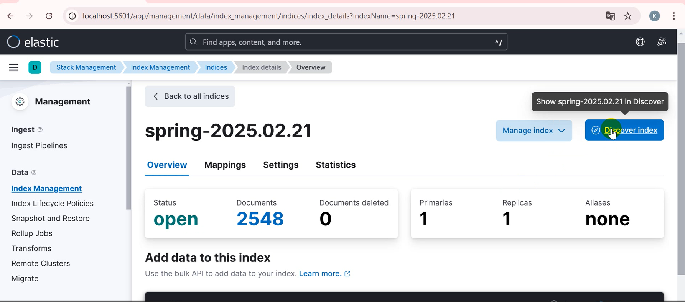
### ✅ Visualiser les logs de l'application:
#### Vous pouvez désormais voir les logs générés par votre application :

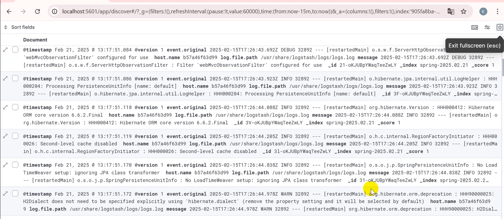
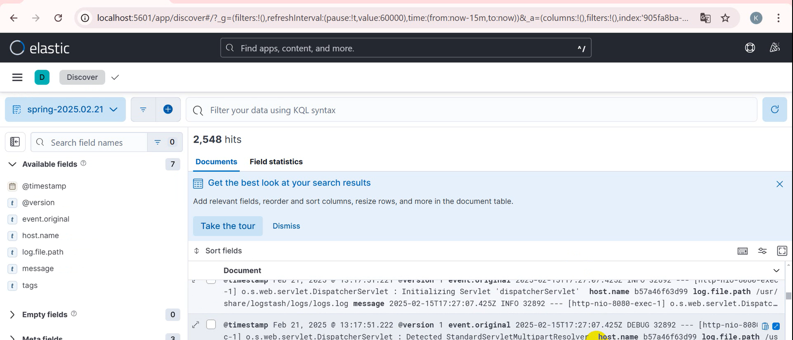

### 🚀Voilà! Votre stack ELK est maintenant prête à être utilisée ! 🎉
Auteur: Khadidiatou DIA / sokhnakhadidjah@gmail.com